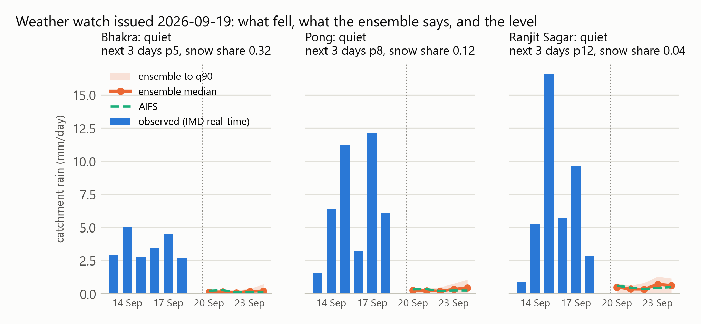
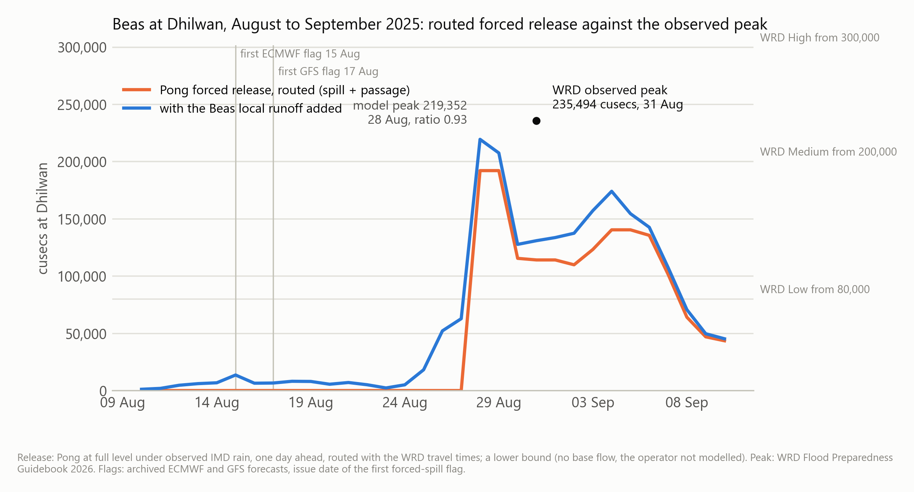
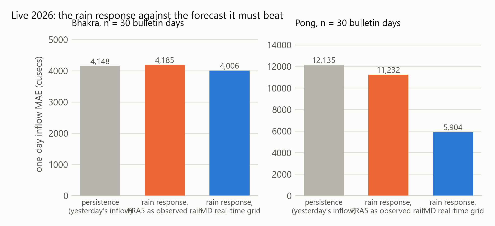
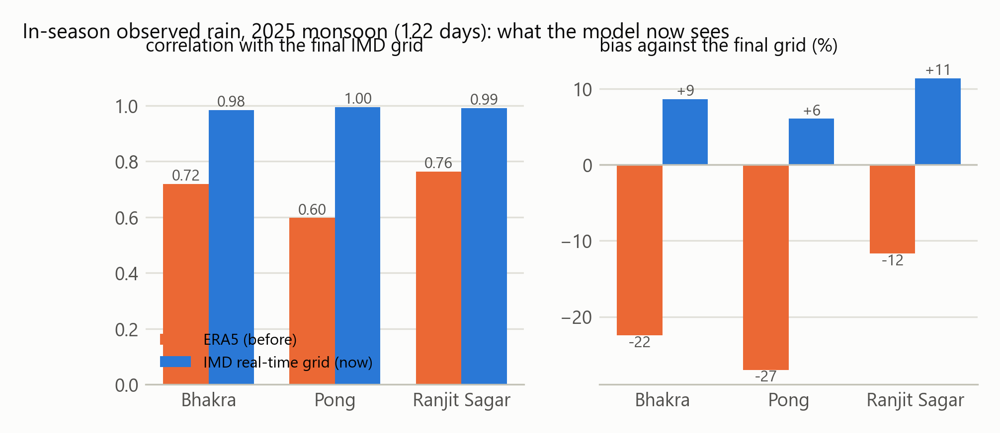
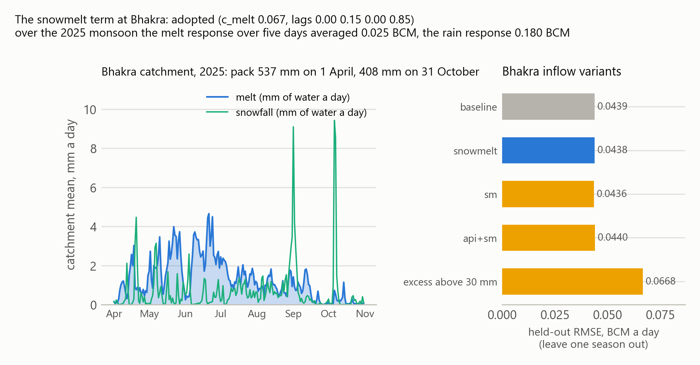

# The river watch, in ten minutes

A daily forecast of whether the Bhakra and Pong spillways will be forced open in the
next five days, what that release does at five points on the Punjab rivers, and how
much rain is coming over each catchment. Everything below is drawn from
[`verification.md`](verification.md), which the package renders from its outputs; the
figures come from `scripts/make_brief_figures.py` on the same files.

## The question

Punjab's largest river floods are dam-release floods. In late August 2025 the Beas rose
into Pong while the reservoir was already near its flood cushion, BBMB released through
the floodgates, and the wave peaked at Dhilwan on 31 August. The watch asks how many
days before the gates must open the rain forecasts, run through a water balance of the
reservoir, can say so.

## What it reads

- The BBMB daily bulletin: level, inflow and outflow at Bhakra and Pong, fetched every
  morning. Storage comes from each dam's own level-storage relation fitted on the CWC
  record.
- Rain over eight catchments (the three dams, three local catchments between the dams
  and the head works, the Ghaggar and Sutlej reaches), area-weighted over HydroBASINS
  polygons. The observed record is IMD's real-time 0.25 degree grid; the forecasts come
  from four weather models (ECMWF AIFS as the primary, ECMWF IFS, GFS, ICON) and the
  51-member ECMWF ensemble, all keyless.
- Snow at Bhakra: ERA5 snowfall stacked into a pack at each archive point of the
  catchment and released by degree-days, for the half of the catchment the rain grid
  does not cover.

## What it says each day

For each dam and each of the next five days: forecast inflow, headroom, what the
turbines can pass, and the surplus a full reservoir cannot hold. The chance that the
spillway is forced is printed three times, from the rain ensemble alone, with the inflow
model's ordinary-day error added, and with its flood-scale volume error added on top;
the site shows the widest. The forced release is routed downstream on the Water
Resources Department's published travel times and classed Low, Medium or High against
the department's thresholds at Ropar, Phillaur, Harike, Dhilwan and Ferozepur.

The weather watch sits beside it with a level per catchment (quiet, watch, alert) from
rules written before any season was scored: the ensemble median of the next three days
(the primary model when no ensemble is in hand) placed in the 1961 to 2025 record of
monsoon three-day totals, and the share of members, or of models, with a 30 mm day.
The archive hindcast below runs the deterministic branch, because no ensemble is
archived, against the record up to the latest day on disk.

## How it did on the 2025 flood

BBMB's gate log is not public, so the reference is the model's own run under the rain
that fell: a flagged issue day is a hit when that run also forces the spillway within
five days, and the lead is counted from the first hit to that run's first spill and to
the dated Dhilwan peak. Run day by day over the forecasts that were issued at the time,
the watch would have said this before the event:

| dam | first flagged forced spill | reference spill (observed-rain run) | lead | Dhilwan peak | lead | flagged days | false |
|---|---|---|---|---|---|---|---|
| Pong (AIFS) | 17 Aug 2025 | 27 Aug 2025 | 10 days | 31 Aug 2025 | 14 days | 23 | 0 |
| Pong (IFS) | 15 Aug 2025 | 27 Aug 2025 | 12 days | 31 Aug 2025 | 16 days | 25 | 0 |
| Bhakra (AIFS and IFS) | 30 Aug 2025 | none in the window | n/a | n/a | n/a | 3 | 0 |

The press readings on file put Pong's floodgates open from 19 August (66,000 cusecs
released that day), earlier than the reference run spills, so the ten-day lead is
against the model's spill date, not a logged gate opening. At Bhakra BBMB opened the
gates on 19 August at 1,665 ft, below the 1,672.5 ft the 2019 filling schedule in the
package allows for that day (the press quoted a lower 1,662 ft guideline for 2025), so
the watch, which forecasts the spillway's bound, first flagged on 30 August, eleven
days after the opening; the observed-rain run confirmed its three flagged days and
under the 2019 schedule first forces a release on 1 September. In 2024 and 2026,
seasons with no forced spill, no archived model flagged a day at either dam (the AIFS
archive begins in 2025).
The weather watch reached watch level over the Bhakra catchment on 9 August 2025, ten
days before the 19 August gate opening, and alert on 10 August; over Pong and Ranjit
Sagar it was raised at least fourteen days before the largest inflow day. Its false
alarms are counted over 1,029 issue days: 23 of the 119 issue days of 2024 and 20 of
the 105 of 2026 sat at watch or above over Bhakra with no dam event that year.

## How it is doing this season

Against the 2026 BBMB bulletins, one day ahead. The baseline is carrying today's inflow
forward; the difference is what the rain forecast brings.

| dam | days | model MAE (cusecs) | model r | persistence MAE (cusecs) | persistence r |
|---|---|---|---|---|---|
| Bhakra | 30 | 4,040 | 0.58 | 4,148 | 0.56 |
| Pong | 30 | 5,904 | 0.86 | 12,135 | 0.37 |

The observed rain the product carries in season is IMD's real-time grid. Scored against
the final grid over 2025 it lands within 11% of the mean at each dam catchment with r
of 0.98 or better; the ERA5 record it replaced ran 12 to 27% low.

## The snowmelt term

Bhakra's base flow is snowmelt from outside the rain grid. The degree-day term enters
the inflow fit as a lagged variable with its own coefficient (0.067) and lag weights;
it was adopted because the held-out error at Bhakra did not rise and the season peak
rose, from 0.5699 to 0.5775 of the stated peak. Over the 2025 monsoon the melt response
averaged 0.025 BCM over five days, about 2,000 cusecs a day, against bulletin inflows
in the tens of thousands: a seasonal modulation of the base flow.

## What it does not do

- It undershoots flood peaks. Over the 2025 flood periods the model's volumes came to
  0.78 to 1.13 of what BBMB reported, but its largest day was 0.58 of the stated peak.
  Lag weights fitted on ordinary days spread a flood over more days than the river does.
  A day-wise inflow record for 2023 and 2025 is the data that fixes this; `roadmap.md`
  lists the rest.
- Ranjit Sagar has no public daily bulletin, so it has a weather watch and no dam row.
- The Ghaggar has no public gauge history, so it gets the rain forecast and its
  percentile only.
- It is not an official warning. The Punjab WRD, CWC, BBMB and IMD issue those.

## Where it lives

- Live: the river watch section of [bakathefish.github.io/Flood](https://bakathefish.github.io/Flood/#rivers),
  reading `outputs/forecast/latest.json`, which a daily GitHub Action rewrites; the dated
  records beside it are never rewritten, and a same-day rerun gets its own file.
- Code, tests and data: [`punjabflood/`](../) in the Sailaab repository, MIT.
- The full record: [`verification.md`](verification.md), [`design.md`](design.md),
  [`data-sources.md`](data-sources.md), [`roadmap.md`](roadmap.md).
